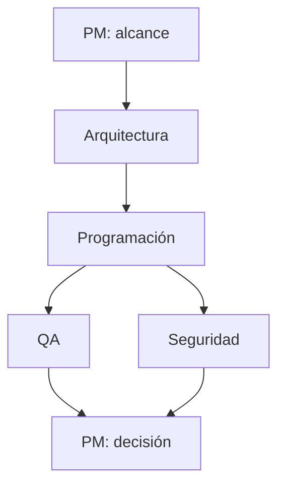

# Agent Team Lab

Mini plataforma reutilizable para cargar un equipo de agentes expertos en cualquier proyecto. El flujo conecta Product Manager, Arquitectura, Programación, QA y Seguridad; cada resultado alimenta las etapas siguientes y PM consolida la decisión final.

Puede consumirse de tres formas:

- como servidor MCP desde Codex, Hermes u otro cliente compatible;
- mediante API REST desde una aplicación;
- con una CLI local para pruebas.

El núcleo no depende de un único modelo. Incluye adaptadores para OpenAI Responses API, endpoints compatibles con OpenAI, Hermes Agent CLI y un proveedor determinista para tests.

## Flujo



La versión `0.1.0` es de solo lectura: recoge archivos de texto del proyecto dentro de una raíz permitida, limita el contexto y devuelve recomendaciones. No ejecuta código del repositorio analizado ni escribe cambios.

## Inicio rápido

Requisitos: Python 3.11+ y [uv](https://docs.astral.sh/uv/).

```bash
git clone https://github.com/Benemox/agent-team-lab.git
cd agent-team-lab
cp .env.example .env
uv sync --extra dev
```

Configura `OPENAI_API_KEY` en tu entorno y prueba:

```bash
uv run agent-team roles
uv run agent-team run "Revisa el flujo de pagos" --project /ruta/al/proyecto
```

La ruta debe estar dentro de `AGENT_TEAM_ALLOWED_ROOT`. Para una prueba sin gastar tokens:

```bash
AGENT_TEAM_PROVIDER=mock AGENT_TEAM_ALLOWED_ROOT="$PWD" \
  uv run agent-team run "Comprueba el equipo" --project "$PWD"
```

## Proveedores

### OpenAI / Codex

Usa Responses API. `OPENAI_MODEL` admite el identificador de modelo disponible en tu proyecto de OpenAI.

```dotenv
AGENT_TEAM_PROVIDER=openai
OPENAI_API_KEY=...
OPENAI_MODEL=gpt-5.4-mini
```

### Hermes Agent

Instala y configura Hermes por separado, comprueba que `hermes` funciona y selecciona el adaptador:

```bash
hermes setup
AGENT_TEAM_PROVIDER=hermes uv run agent-team run "Analiza este módulo" --project .
```

El adaptador usa una ejecución finita `hermes chat --oneshot -q`; conserva la configuración de proveedor/modelo que hayas elegido en Hermes.

### Ollama, vLLM, LocalAI u otro compatible

```dotenv
AGENT_TEAM_PROVIDER=openai-compatible
OPENAI_COMPATIBLE_BASE_URL=http://127.0.0.1:11434/v1
OPENAI_COMPATIBLE_API_KEY=local
OPENAI_COMPATIBLE_MODEL=qwen3-coder
```

## API REST

```bash
AGENT_TEAM_ALLOWED_ROOT=/ruta/a/proyectos uv run agent-team serve
```

Endpoints:

- `GET /health`
- `GET /v1/roles`
- `POST /v1/experts/{role_id}`
- `POST /v1/team/run`
- documentación OpenAPI en `http://127.0.0.1:8008/docs`

Ejemplo:

```bash
curl -X POST http://127.0.0.1:8008/v1/team/run \
  -H 'Content-Type: application/json' \
  -H "Authorization: Bearer $AGENT_TEAM_API_TOKEN" \
  -d '{"task":"Revisa el login", "project_path":"/ruta/a/proyectos/mi-app"}'
```

Define `AGENT_TEAM_API_TOKEN` antes de exponer el servicio fuera de localhost. El contenedor monta los proyectos en modo solo lectura.

## MCP y plugin

El repositorio ya incluye `.codex-plugin/plugin.json`, `.mcp.json` y cinco skills. Tras instalar dependencias, el servidor puede arrancarse con:

```bash
uv run agent-team-mcp
```

Expone las herramientas:

- `list_experts`
- `ask_expert`
- `run_team`

Para incorporar el equipo a otro repositorio sin instalar el plugin completo, añade este servidor a la configuración MCP del cliente y usa el directorio clonado como directorio de trabajo:

```json
{
  "mcpServers": {
    "agent-team-lab": {
      "command": "uv",
      "args": ["run", "--directory", "/ruta/agent-team-lab", "agent-team-mcp"],
      "env": {
        "AGENT_TEAM_PROVIDER": "openai",
        "AGENT_TEAM_ALLOWED_ROOT": "/ruta/a/proyectos"
      }
    }
  }
}
```

No escribas la API key dentro del JSON si el archivo se va a versionar; pásala mediante variables del sistema o un almacén de secretos.

## Personalizar el equipo

- Edita perfiles en `skills/*/SKILL.md`.
- Cambia orden, paralelismo y objetivos en `config/team.yaml`.
- Añade un proveedor implementando `AgentProvider` y registrándolo en `providers/factory.py`.
- Ajusta extensiones, límites y carpetas ignoradas en `context.py`.

## Verificación

```bash
uv run ruff check src tests
uv run pytest
```

## Diseño de seguridad

- raíz de proyectos permitida y bloqueo de path traversal;
- límites de bytes y archivos enviados al modelo;
- carpetas de dependencias, caché y control de versiones excluidas;
- contexto marcado como no confiable frente a prompt injection;
- sin shell para analizar proyectos y sin escrituras automáticas;
- Hermes se invoca con argumentos, no mediante `shell=True`;
- token Bearer opcional para REST y escucha local por defecto.

## Licencia

MIT.

